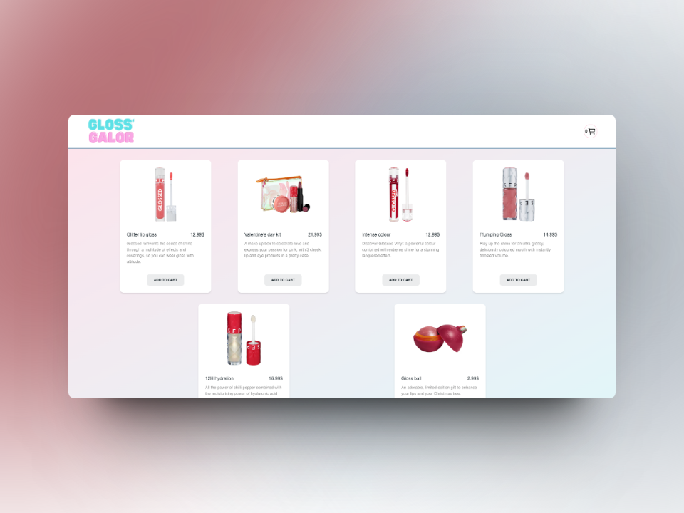

# Gloss'Galor Shop Simulator

The Gloss'Galor Simulator is a virtual storefront designed to replicate the experience of shopping for lip gloss products online. This interactive app provides users with a platform to explore a variety of lip gloss options, add products to their cart offering a realistic e-commerce shopping experience tailored specifically for lip gloss enthusiasts.

## Features:
- **Product Catalog:** Presents a curated selection of lip gloss products, featuring different shades, formulations, and finishes.
- **Add to Cart:** Allows users to easily add lip gloss products to their virtual shopping cart with a simple click or tap.
- **Cart Management:** Provides functionality to view, edit, and remove items from the shopping cart before proceeding to checkout.
- **Product Details:** Offers detailed information about each lip gloss product, including shade names, descriptions, and pricing.
- **Visual Representation:** Includes high-quality images or swatches of lip gloss shades to help users visualize the products before making a purchase.
- **Responsive Design:** Ensures compatibility across various devices and screen sizes, providing a seamless shopping experience on desktop and mobile devices alike.

## How to Use:
1. **Browse Lip Gloss Products:** Explore the product catalog to discover a range of lip gloss shades and formulations.
2. **Add Products to Cart:** Click or tap on desired lip gloss products to add them to your virtual shopping cart.
3. **Review Cart Contents:** Navigate to the cart page to review and adjust the items in your shopping cart as needed.

## Contribution:
Contributions to the Lip Gloss Shop Simulator are welcome! Whether you'd like to suggest new lip gloss shades, enhance the user interface, or improve the checkout process, your input is valuable to our project. Feel free to contribute to our repository on GitHub or provide feedback through our app's contact form.

